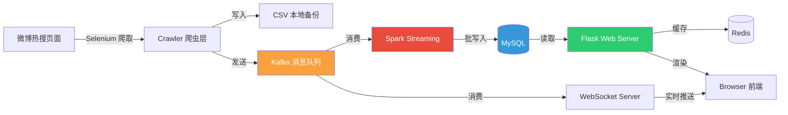
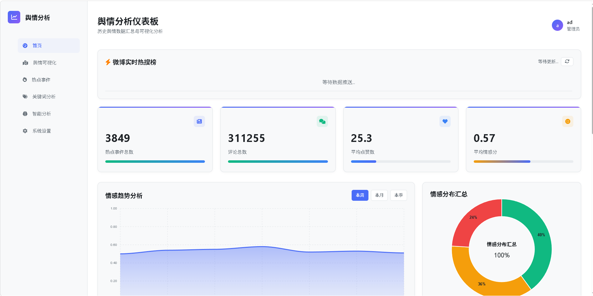
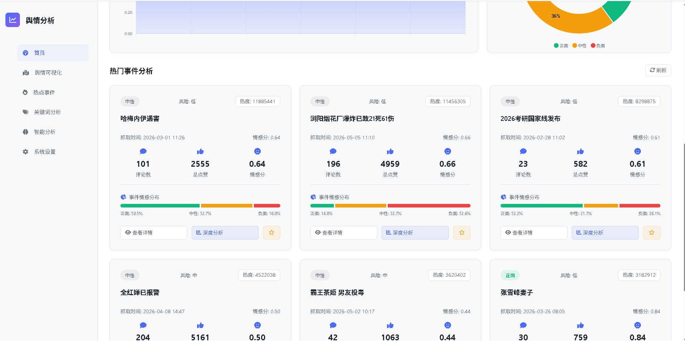
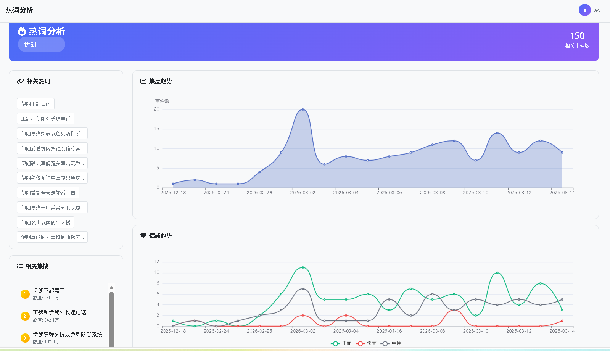
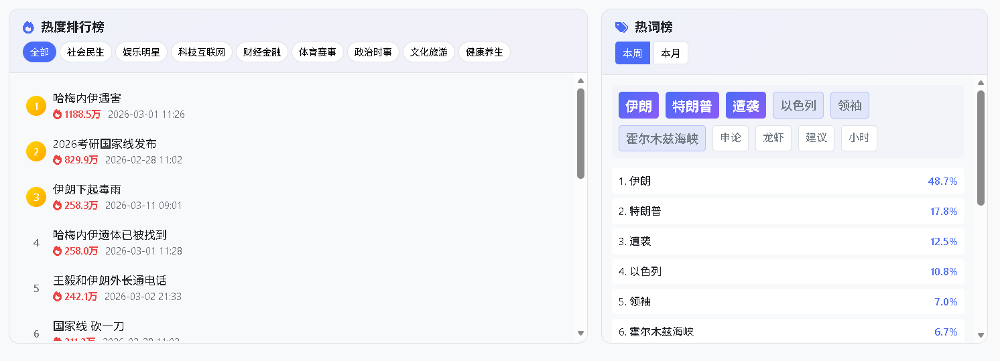
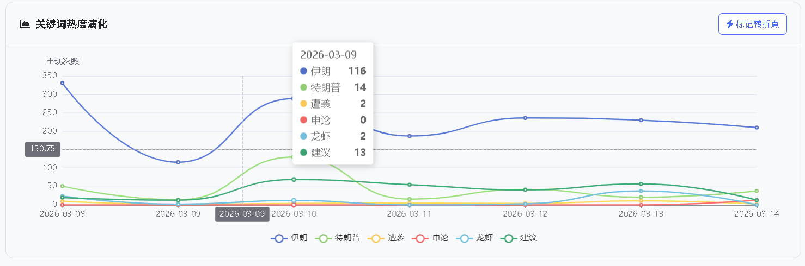
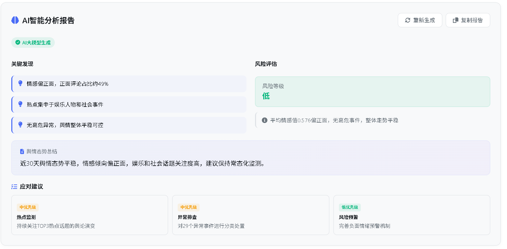
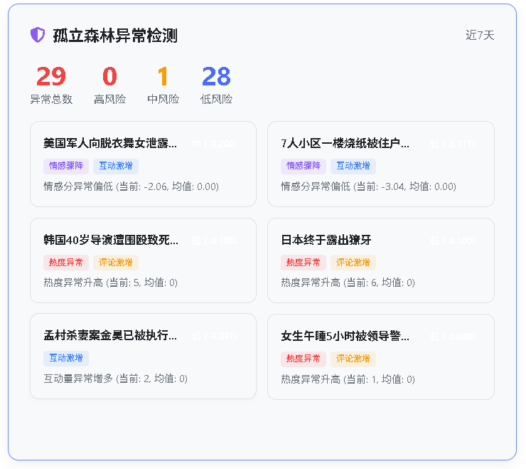
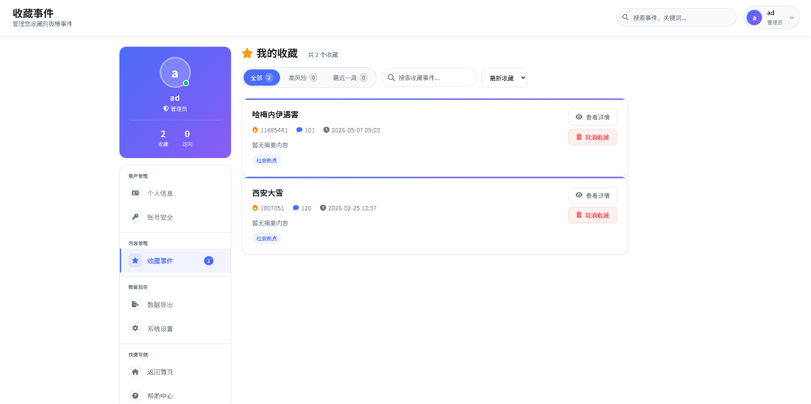
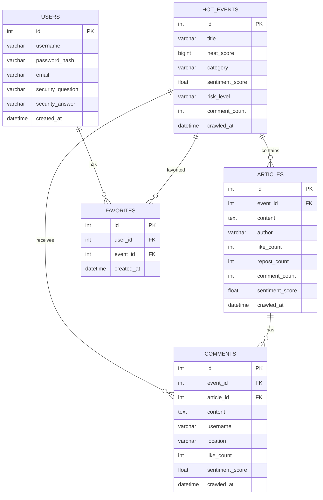

# 舆情分析系统 · Public Opinion Analysis

<div align="center">


**微博热搜全链路舆情监控平台 — 从数据采集、流式处理、情感分析到可视化展示**

</div>

---

## 目录

- [项目概述](#项目概述)
- [系统架构](#系统架构)
- [数据流](#数据流)
- [功能矩阵](#功能矩阵)
- [界面预览](#界面预览)
- [技术栈](#技术栈)
- [项目结构](#项目结构)
- [快速开始](#快速开始)
- [数据库设计](#数据库设计)
- [License](#license)

---

## 项目概述

本系统是一套面向微博热搜事件的 **实时舆情分析解决方案**，覆盖舆情监控全流程：

1. **采集** — Selenium 自动化爬虫抓取微博热搜榜单、关联文章及用户评论
2. **传输** — Apache Kafka 多主题消息队列解耦生产与消费
3. **处理** — Spark Structured Streaming 实时消费、清洗、入库
4. **分析** — SnowNLP 情感分析 + Isolation Forest 异常检测 + 影响力评分模型
5. **展示** — Flask Web 仪表盘，Chart.js / Matplotlib 多维度可视化

适用于舆情监控学习、大数据处理实践、全栈项目作品展示等场景。

---

## 系统架构



**组件说明：**

| 组件 | 技术选型 | 职责 |
|------|----------|------|
| 爬虫层 | Selenium + Edge WebDriver | 模拟登录、翻页抓取、实时情感打分 |
| 消息队列 | Apache Kafka（4 Topic） | events / articles / comments / hot_rank 解耦 |
| 流处理 | PySpark Structured Streaming | 消费 Kafka、JSON 解析、去重写入 MySQL |
| 实时推送 | WebSocket（端口 8765） | 热榜排行实时广播至前端 |
| 业务服务 | Flask 3 + Blueprint 模块化 | 仪表盘、事件分析、用户系统、数据导出 |
| 缓存层 | Redis + 内存Cache | 双层缓存加速热点数据访问 |
| 存储层 | MySQL (PyMySQL + 连接池) | 事件、文章、评论、用户数据持久化 |

---

## 数据流

```
                   ┌──────────────┐
                   │  weibo_crawler │  主爬虫：热搜 → 文章 → 评论
                   └──────┬───────┘
                          │ 实时情感打分 (SnowNLP + 自定义词典)
                          ▼
              ┌───────────────────────┐
              │      Kafka Cluster     │
              │                        │
              │  weibo.hot.events     │  热搜事件
              │  weibo.hot.articles   │  关联文章
              │  weibo.hot.comments   │  用户评论
              │  weibo.hot.rank       │  热榜排行
              └───────┬───────────────┘
                      │
          ┌───────────┼───────────┐
          ▼                       ▼
┌─────────────────┐    ┌─────────────────┐
│  Spark Streaming │    │  WebSocket Svr   │
│  · JSON 解析     │    │  · 热榜实时广播   │
│  · 数据校验      │    │  · 端口 8765     │
│  · 批写入 MySQL  │    └────────┬────────┘
└────────┬────────┘             │
         │                      ▼
         ▼              ┌─────────────┐
┌─────────────┐         │   Browser    │
│    MySQL     │◄────────│  Chart.js    │
│  持久化存储   │  Flask  │  实时渲染     │
└─────────────┘  API    └─────────────┘
```

---

## 功能矩阵

### 数据采集

| 模块 | 文件 | 功能 |
|------|------|------|
| 主爬虫 | `crawlers/weibo_crawler.py` | 打开微博热搜榜 → 遍历每个话题 → 采集文章（内容/作者/互动数据）→ 翻页抓取评论（用户名/内容/点赞/地区） |
| 热榜爬虫 | `crawlers/hot_search_crawler.py` | 每 120s 定时抓取热榜排名，发送至 Kafka `hot_rank` 主题 |
| 按需爬虫 | `crawlers/comment_crawler.py` | Web UI 触发的单事件评论增量爬取，自动去重 |
| 本地备份 | CSV 导出 | 爬取数据自动写入 `weibo_crawl_backup/`，支持 Excel 导出 |

### NLP 分析引擎

| 能力 | 实现 | 细节 |
|------|------|------|
| **情感分析** | SnowNLP + 自定义词典 | 150+ 词情感词典校准，多进程批处理，输出 0-1 得分 |
| **情感分类** | 三级分类 | 正面 (>0.7) / 中性 (0.3-0.7) / 负面 (<0.3) |
| **关键词提取** | jieba TF-IDF + KeyBERT | 词性过滤（名词/动词）、停用词清洗、去重 |
| **事件分类** | 正则匹配 | 自动归类为 社会/政治/财经/娱乐/科技/体育/文旅 7 大类 |

### 机器学习

| 模型 | 算法 | 说明 |
|------|------|------|
| **异常检测** | Isolation Forest | `n_estimators=100, contamination=0.05`，识别偏离正常模式的舆情事件 |
| **影响力评分** | 五因子加权 | 热度(25%) + 评论数(25%) + 互动量(20%) + 情感倾向(15%) + 时间衰减(15%) |
| **趋势预测** | 加权线性回归 | 时间衰减权重，预测未来情感走向 |

### Web 功能

- **仪表盘** — 风险指数、情感趋势折线图、正/中/负占比饼图、热搜排行、风险预警
- **事件详情** — 单事件情感分布、评论分页分析、关联文章列表、动态词云
- **智能分析** — 异常检测结果、影响力排名、AI 趋势报告（MiniMax LLM）
- **关键词分析** — 高频词排行、热度演化、词云可视化
- **数据导出** — 事件 / 评论 CSV 或 Excel 导出
- **用户系统** — 注册/登录、密保找回密码、个人收藏夹

---

## 界面预览

<details open>
<summary><b>仪表盘</b></summary>
<br>
<table>
  <tr>
    <td></td>
    <td></td>
  </tr>
</table>
</details>

<details>
<summary><b>关键词分析</b></summary>
<br>
<table>
  <tr>
    <td></td>
    <td></td>
  </tr>
  <tr>
    <td colspan="2"></td>
  </tr>
</table>
</details>

<details>
<summary><b>智能分析</b></summary>
<br>
<table>
  <tr>
    <td></td>
    <td></td>
  </tr>
</table>
</details>

<details>
<summary><b>登录 & 收藏</b></summary>
<br>
<table>
  <tr>
    <td></td>
    <td></td>
  </tr>
</table>
</details>

---

## 技术栈

| 层级 | 技术 | 版本 |
|------|------|------|
| **语言** | Python | 3.9+ |
| **Web 框架** | Flask + Jinja2 + Werkzeug | 3.1 |
| **数据库** | MySQL (PyMySQL) | 5.7+ |
| **缓存** | Redis (redis-py) | — |
| **消息队列** | Apache Kafka (kafka-python) | 2.13+ |
| **流处理** | Apache Spark Structured Streaming | 3.5.0 |
| **爬虫** | Selenium | 4.38 |
| **中文分词** | jieba | — |
| **情感分析** | SnowNLP | — |
| **语义提取** | KeyBERT | — |
| **机器学习** | scikit-learn (IsolationForest) | — |
| **可视化** | matplotlib · wordcloud · Chart.js | 3.10 / CDN |
| **数据处理** | pandas · numpy | 2.3 |
| **任务调度** | APScheduler | — |
| **实时推送** | websockets · trio-websocket | — |
| **LLM** | MiniMax API (Anthropic 兼容格式) | — |

---

## 项目结构

```
project/
│
├── app.py                         # Flask 应用入口，Blueprint 注册，连接池初始化
├── config.py                      # 全局配置类（全部支持环境变量覆盖）
├── requirements.txt               # Python 依赖清单
│
├── crawlers/                      # ── 数据采集层 ──
│   ├── weibo_crawler.py           #   主爬虫：热搜 → 文章 → 评论（870 行）
│   ├── hot_search_crawler.py      #   热榜定时爬虫（120s 间隔 → Kafka）
│   └── comment_crawler.py         #   Web UI 触发式增量评论爬虫
│
├── kafka_producer/                # ── 消息生产层 ──
│   └── weibo_hot_producer.py      #   多主题 Kafka 生产者 API
│
├── spark_streaming/               # ── 流式处理层 ──
│   ├── weibo_hot_consumer.py      #   Spark 流消费者：3 个 Kafka Topic → MySQL
│   └── hot_search_consumer.py     #   WebSocket 服务：实时广播热榜排行
│
├── routes/                        # ── 路由控制层 ──
│   ├── auth_routes.py             #   认证：登录 / 注册 / 找回密码
│   ├── dashboard_routes.py        #   核心：仪表盘 / 事件详情 / 深度分析
│   ├── analysis_routes.py         #   数据 API：统计 / 事件 / 评论 / 情感
│   ├── visualization_routes.py    #   可视化 API：图表数据
│   ├── keywords_routes.py         #   关键词：词频 / 热度演化 / 词云
│   ├── csv_export_routes.py       #   导出：CSV / Excel
│   └── favorite_routes.py         #   收藏：用户书签管理
│
├── services/                      # ── 业务服务层 ──
│   ├── ml_service.py              #   ML：异常检测 / 影响力评分 / 趋势预测 / AI 报告
│   ├── analysis_service.py        #   分析：情感趋势 / 分类分布 / 关键词提取 / 词云
│   ├── realtime_service.py        #   实时：事件实时查询 / 情感趋势更新
│   ├── auth_service.py            #   认证：登录验证 / 密保校验
│   ├── favorite_service.py        #   收藏：增删查
│   ├── redis_service.py           #   缓存：Redis 热点数据缓存
│   ├── cache_service.py           #   缓存：线程安全内存缓存
│   ├── csv_export_service.py      #   导出：数据格式化与导出
│   └── visualization_service.py   #   可视化：Matplotlib 图表生成
│
├── models/                        # ── 数据模型层 ──
│   ├── event.py                   #   热搜事件 CRUD + 情感评分 + 风险等级
│   ├── article.py                 #   关联文章 CRUD
│   ├── comment.py                 #   用户评论 CRUD + 情感分布统计
│   └── user.py                    #   用户模型 + 密码哈希
│
├── utils/                         # ── 工具层 ──
│   ├── text_utils.py              #   NLP 核心：情感分析 / 关键词 / 分类（675 行）
│   ├── db_utils.py                #   数据库：连接池（25 连接）/ 上下文管理器 / 装饰器
│   ├── kafka_utils.py             #   Kafka：生产者单例 / JSON 序列化 / 异步回调
│   └── chart_utils.py             #   图表：Matplotlib 折线图 / 柱状图 / 饼图
│
├── templates/                     # ── 前端模板（22 个 Jinja2 文件）──
│   ├── base.html                  #   基础布局
│   ├── dashboard.html             #   仪表盘首页
│   ├── hot_events.html            #   热搜列表
│   ├── event_detail.html          #   事件详情
│   ├── event_deep_analysis.html   #   深度分析
│   ├── ml_dashboard.html          #   智能分析面板
│   ├── keywords.html              #   关键词分析
│   ├── visualization.html         #   可视化页面
│   ├── csv_export.html            #   数据导出
│   ├── login.html / register.html #   认证页面
│   └── ...                        #   其他功能页面
│
├── docs/images/                   # ── 文档截图 ──
│
├── models/ml_models/              # ── ML 模型文件 ──
│   ├── lstm_sentiment_model.h5    #   LSTM 情感模型
│   └── lstm_scaler.pkl            #   特征标准化器
│
└── weibo_crawl_backup/            # ── 爬虫 CSV 备份 ──
```

---

## 快速开始

### 前置依赖

| 服务 | 最低版本 | 说明 |
|------|----------|------|
| Python | 3.9+ | 推荐 3.10+ |
| MySQL | 5.7+ | 字符集需支持 utf8mb4 |
| Kafka | 2.13+ | 需创建 4 个 Topic（见下方） |
| Spark | 3.5+ | 环境变量中需配置 `SPARK_HOME` |
| Redis | 6.0+ | 可选，不启动则自动降级为内存缓存 |
| Edge 浏览器 | 最新版 | 爬虫依赖 |

### 1. 克隆项目

```bash
git clone https://github.com/Lyb-L-dev/public-opinion-analysis.git
cd public-opinion-analysis
```

### 2. 创建虚拟环境

```bash
python -m venv venv

# Windows
venv\Scripts\activate

# macOS / Linux
source venv/bin/activate
```

### 3. 安装依赖

```bash
pip install -r requirements.txt

# requirements.txt 包含基础依赖，以下 NLP/ML 相关库需补充安装：
pip install jieba snownlp kafka-python redis APScheduler scikit-learn \
            wordcloud keybert websockets confluent_kafka
```

### 4. 初始化 Kafka Topic

```bash
kafka-topics.sh --create --topic weibo.hot.events   --bootstrap-server localhost:9092
kafka-topics.sh --create --topic weibo.hot.articles  --bootstrap-server localhost:9092
kafka-topics.sh --create --topic weibo.hot.comments  --bootstrap-server localhost:9092
kafka-topics.sh --create --topic weibo.hot.rank      --bootstrap-server localhost:9092
```

### 5. 配置环境变量

```bash
# 数据库
export DB_HOST=localhost
export DB_USER=root
export DB_PASSWORD=your_password
export DB_NAME=public_opinion_db

# Kafka
export KAFKA_BROKER=localhost:9092

# 爬虫（按你的实际路径填写）
export EDGE_USER_DATA_DIR=C:/Users/.../Edge/User Data/Default
export EDGE_DRIVER_PATH=D:/edgedriver/msedgedriver.exe
```

### 6. 启动服务

按顺序执行，每个命令在独立终端窗口中运行：

```bash
# Terminal 1 — Spark 流处理消费者
python spark_streaming/weibo_hot_consumer.py

# Terminal 2 — WebSocket 热榜推送（可选）
python spark_streaming/hot_search_consumer.py

# Terminal 3 — 热榜定时爬虫（可选）
python crawlers/hot_search_crawler.py

# Terminal 4 — Flask Web 服务
python app.py
```

浏览器访问 **http://localhost:5000**

### 7. 开始采集数据

在仪表盘页面手动触发爬虫，或直接运行：

```bash
python crawlers/weibo_crawler.py
```

---

## 数据库设计



**核心字段说明：**

| 表 | 关键字段 | 说明 |
|----|----------|------|
| `hot_events` | `sentiment_score` | 综合情感得分（0~1），由关联文章和评论聚合计算 |
| `hot_events` | `risk_level` | 风险等级：`low` / `medium` / `high`，由负面评论占比决定 |
| `articles` | `sentiment_score` | 文章级别情感得分，爬取时实时计算 |
| `comments` | `sentiment_score` | 评论级别情感得分，爬取时实时计算 |
| `comments` | `location` | 评论者 IP 属地（微博显示的地理位置） |

---

## License

MIT License — 欢迎 Star、Fork 和学习交流。
